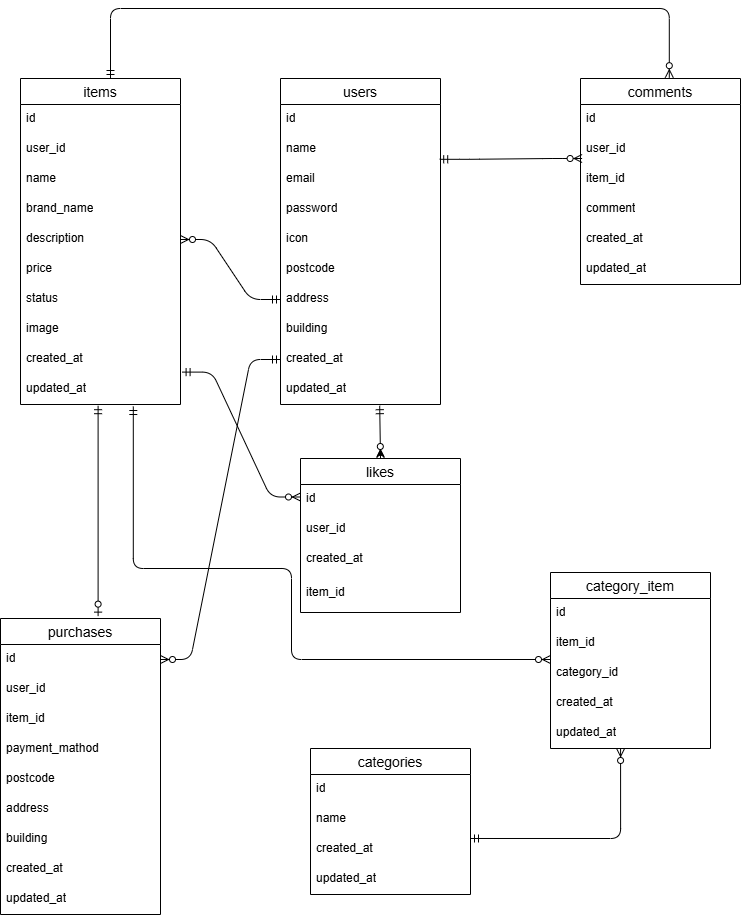

# Furima-app

フリマアプリを模したWebアプリケーションです。
ユーザー登録、商品出品、購入、コメント、いいね機能などを実装しています。

## 環境構築

#### リポジトリをクローン

```
git clone git@github.com:yuki8293/furima-app.git
```

#### Laravelのビルド

```
docker-compose up -d --build
```

#### Laravel パッケージのダウンロード

```
docker-compose exec php bash
composer install
exit

```

#### .env ファイルの作成

```
cp .env.example .env
```

#### .env ファイルの修正

```
DB_CONNECTION=mysql
DB_HOST=mysql
DB_PORT=3306
DB_DATABASE=laravel_db
DB_USERNAME=laravel_user
DB_PASSWORD=laravel_pass

```

#### キー生成

```
php artisan key:generate
```

#### マイグレーション・シーディングを実行

```
php artisan migrate --seed
```

### ストレージリンク

```
php artisan storage:link
```

## テスト実行

```
php artisan test
```
## 使用技術（実行環境）

フレームワーク：Laravel 8.x

言語：PHP 8.x

Webサーバー：Nginx 1.21.1

データベース：MySQL 8.0.26

## ER図



## URL

アプリケーション：http://localhost

phpMyAdmin：http://localhost:8080
